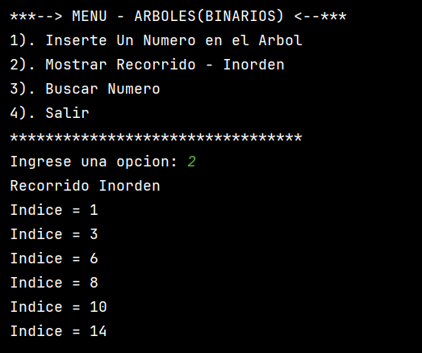
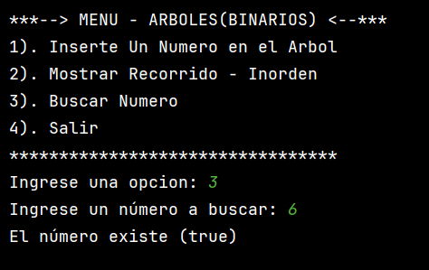
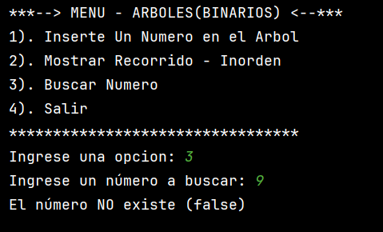

# ARBOL BINARIO
Es una estructura de datos no lineal que está formada por nodos
en un conjunto de ramas. Estos están interconectados por los nodos
en donde cada nodo puede tener hasta 2 hijos (Izquierdo y Derecho).
El nodo en la parte superior del árbol se llama nodo raíz,
Los nodos que no tienen hijos se llaman hojas, y el resto de
los nodos se denominan nodos internos.

--> **IMPLEMENTACIÓN**
* Una clase principal llama Arbol contiene un nodo raíz que 
representa el inicio del árbol. Cada nodo se define con una 
clase interna llamada Nodo, que tiene referencias hacia su padre,
hijo izquierdo, hijo derecho y almacena un valor llamado llave.
* Un constructor que inicializa el árbol vacío, es decir, 
con la raíz en null
* El método insertar(int i) permite agregar un nuevo nodo.
Si el árbol está vacío, el nodo se convierte en la raíz. 
Si no lo está, se recorre desde la raíz hasta encontrar la 
posición adecuada:
  * Si el valor del nuevo nodo es menor que el actual, 
  se mueve hacia la izquierda. 
  * Si es mayor o igual, se mueve hacia la derecha.
  Cuando encuentra un espacio libre, lo asigna como hijo 
  izquierdo o derecho del nodo correspondiente.
* El método recorrer(Nodo n) realiza un recorrido inorden
   * Visita el subárbol izquierdo. 
   * Muestra el valor del nodo actual. 
   * Visita el subárbol derecho.
   * Esto permite imprimir los valores en orden ascendente.
* El método buscar(int valor) inicia una búsqueda desde la raíz 
para verificar si un número existe dentro del árbol.
   * Si el nodo es null, significa que no se encontró el número. 
   * Si el valor coincide con la llave del nodo, se retorna true. 
   * Si el valor es menor, busca recursivamente en el lado izquierdo. 
   * Si es mayor, busca en el derecho.
* La clase main implementa el menú interactivo en consola para que
el usuario pueda ingresar datos en el arbol.

--> **EJEMPLOS DE EJECUCIÓN**

--> **INTEGRANTES DEL GRUPO**
* `Sara Gabriela Castro Mora`
* `Santiago Pérez Pino`
